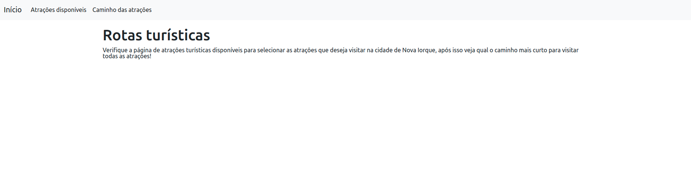
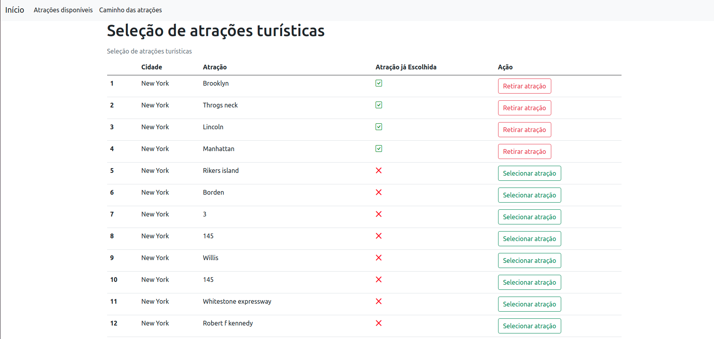
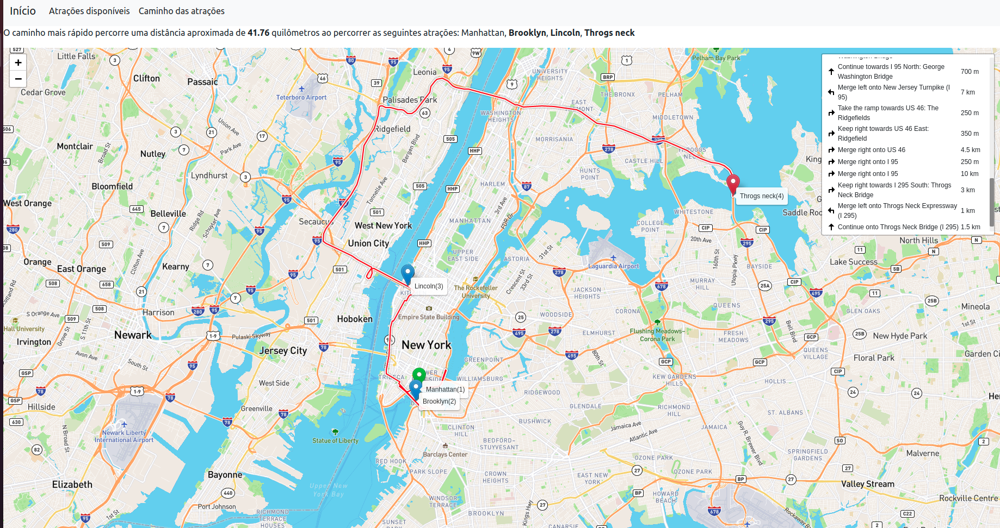

# Grafos2_Find_Bacon

**Número da Lista**: 2<br>
**Conteúdo da Disciplina**: Grafos 2 (Dijkstra)<br>

## Alunos
|Matrícula   |               Aluno                  |
| ---------- | ------------------------------------ |
| 15/0132590 |      João Vitor Ramos de Souza       |

## Sobre 

O Tourism_Routes tem como objetivo traçar a menor rota possível entre todas as atrações turísticas selecionadas pelo usuário. No projeto foi utilizada a API do Mapbox para se calcular a distância entre as atrações turísticas e realizar a renderização do mapa que exibe a menor rota das atrações turísticas. Para se traçar o menor caminho entre todas as atrações foi implementado o algoritmo de Dijkstra.

## Screenshots
1. Página inicial da aplicação
   
2. Atrações disponíveis
   
3. Menor caminho das atrações disponíveis
   

## Instalação 
**Linguagem**: Python<br>
**Framework**: Django<br>

Pré-requisitos para rodar o **Tourism_Routes**:

É necessário ter o Python (versão 3.8.x), Pip e docker-compose instalados em seu sistema operacional.

Instale as dependências do Python no seu sistema operacional com o seguinte comando:
```sh
$ git clone https://github.com/projeto-de-algoritmos/Grafos2_Tourism_Routes
$ cd Grafos2_Tourism_Routes
$ pip3 install -r requirements.txt
```

Também é necessário ter um banco de dados Postgres sendo executado e para isso foi adicionado o docker-compose para se facilitar a criação do ambiente. Com o docker-compose instalado, basta executar o seguinte comando:

```sh
$ docker-compose up
```

**Importante:** O comando `docker-compose up` irá inutilizar o terminal aberto, para se subir o container do banco de dados em bacground, basta executar o comando `docker-compose up -d`

Realize as migrações do banco de dados com o seguinte comando:
```sh
$ python manage.py migrate
```

Para facilitar a primeira execução do projeto, foi adicionado o arquivo `dump.zip` com um arquivo `json` para carregar o dump de 100 atrações turísticas da cidade de Nova Iorque. Extraia o arquivo `dump.zip` e execute os seguintes comandos para carregar o grafo no banco de dados.

Carregando dados:
```sh
$ unzip dump.zip # Comando para extrair arquivos .zip em ambientes linux
$ python manage.py loaddata new_york_attractions.json
```
**Importante: Para o mapa ser renderizado com sucesso e as requisições para o Mapbox funcionarem corretamente, deve ser gerado um `access_token` ao se cadastrar no site do Mapbox. Após finalizar seu cadastro no Mapbox será possível visualizar o seu `access_token`, caso tenha dificuldades acesse essa página de ajuda do Mapbox para maiores informações**

Suba o servidor Django com o comando abaixo:
```sh
$ python manage.py runserver
```

## Uso 

1. Com todos os comandos de instalação já executados, abra seu navegador em `http://localhost:8000`
2. Para visualizar as atrações turísticas disponíveis para busca, clique na navbar em **Atrações disponíveis** ou acesse a url `http://localhost:8000/attractions/`. Nessa página é possível que se selecione todas as atrações para se traçar o menor caminho entre elas.
3. Para visualizar o menor caminho entre todas as atrações turísticas selecionadas, clique em **Caminho das atrações** ou acesse a url `http://localhost:8000/map`. Com isso, será exibido o menor caminho entre as atrações turísticas.

## Outros 

Caso não queira utilizar um número maior de atrações turísticas, existe um comando disponível para carregar as atrações turísticas na base de dados. Para executá-lo é necessário rodar o comando:
```sh
$ unzip dump.zip # Comando para extrair arquivos .zip em ambientes linux
$ python manage.py load_tourism_attractions ---qty-attractions=<quantidade de atrações turísticas>
```


